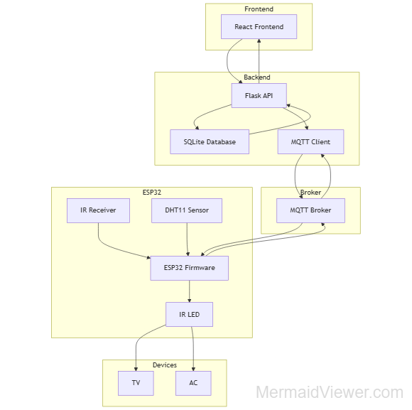

# 🏠 Home Automation System

A **full-stack IoT home automation platform** built with **ESP32, MQTT, Flask, and React**, designed with real-world architecture principles: decoupled services, event-driven communication, and scalable device management.

This project integrates embedded hardware with a modern web dashboard, enabling **real-time control, sensor monitoring, IR learning**, and **role-based user management**.

---

## 🧰 Tech Stack

### Frontend
- React
- CSS (custom, responsive layout)

### Backend
- Flask
- SQLite
- REST APIs
- MQTT client

### Embedded / IoT
- ESP32
- MicroPython
- IR Receiver & IR LED
- DHT11 sensor

### Communication
- MQTT (event-driven, decoupled)

---

## 🚀 Features

### 🔌 Device Control
- Real-time control of devices via MQTT
- Stateless ESP32 firmware (backend-driven logic)
- Reliable device state synchronization

### 🌡️ Sensor Monitoring
- Temperature & humidity monitoring
- Live updates on the frontend
- Backend-managed sensor persistence

### 📡 IR Learning & Playback
- Capture raw IR signals from remotes
- Store learned IR codes dynamically
- Replay IR commands on demand (TVs, ACs, etc.)

### 👤 User Management
- Secure authentication system
- Role-based access control (**admin / user**)
- Admin-only device and user management

### 🖥️ Modern Dashboard
- Responsive React UI
- Live device cards & sensor data
- Clean, professional design

---

## 🧠 System Architecture




## 🔐 Security & Design Choices

- Authentication handled exclusively by the backend
- Role validation enforced server-side
- Devices never trust the frontend directly
- MQTT topics structured for scalability

---

## 📂 Project Structure

```
Home-Automation-System/
├── backend/
│   ├── app/
│   │   ├── __init__.py
│   │   ├── config.py
│   │   ├── mqtt_client.py
│   │   ├── database/
│   │   ├── services/
│   │   ├── utils/
│   │   ├── routes/
│   │   └── models/
|   |
│   ├── run.py
│   ├── requirements.txt
│   └── database.db
|
├── frontend/
│   └── src/
│       ├── components/
│       ├── api/
│       ├── App.js
│       └── styles.css
|
├── firmware/
│   ├── drivers/
│   ├── devices/
│   ├── IR_codes/
│   ├── ir_rx/
│   ├── ir_tx/
│   ├── mqtt/
│   ├── boot.py
│   ├── config.py
│   └── main.py
|
├── tests/
|
└── Docker/
```
---

# ⚙️ System Overview

## ✔ Backend (Flask)
Provides REST API endpoints for:

- User authentication (JWT)
- LED control (via MQTT + SQLite)
- Sensor data storage & retrieval
- MQTT bridge between ESP32 ↔ frontend

MQTT Messages:
- Sensor data: `home/sensor/data`
- DEVICES state updates: `home/devices/id/state`

The backend both **subscribes** to these topics and **publishes** state changes.

---

## ✔ Frontend (React)
The frontend dashboard includes:

- Live sensor readings  
- Historical graph  
- LED control panel  
- Login system  
- MQTT real-time updates (WebSockets)

Connects to:
```
wss://test.mosquitto.org:8081
```

---

## ✔ ESP32 (MicroPython)
Firmware responsibilities:

- Read temperature & humidity
- Publish sensor data to `home/sensor/data`
- Subscribe to `home/devices/id/state` to toggle LED
- Send readings at configurable intervals

---

# 🔐 Authentication

The system uses **JWT tokens**:

1. Frontend sends login credentials  
2. Backend validates them (stored in SQLite)  
3. Returns JWT token  
4. Frontend stores token in `localStorage`  
5. Every API call includes `Authorization: Bearer <token>`  
6. Backend verifies via `auth_middleware`

---

# 📡 MQTT Topics

| Topic | Direction | Payload | Description |
|-------|-----------|---------|-------------|
| `home/sensor/data` | ESP32 → Backend/Frontend | `{ "temperature": X, "humidity": Y }` | Live sensor data |
| `home/devices/id/state` | Backend → ESP32/Frontend | `{ "state": "on" }` | DEVICE state updates |

---

# 🛠 Installation & Setup

## 1️⃣ Clone the repository
```
git clone https://github.com/TomasGB/Home-Automation-System
cd Home-Automation-System
```

---

## 2️⃣ Backend Setup

### Install dependencies:
```
cd backend
pip install -r requirements.txt
```

### Start the server:
```
python run.py
```

Backend runs on:

```
http://localhost:5000
```

---

## 3️⃣ Frontend Setup

```
cd frontend
npm install
npm start
```

Runs on:

```
http://localhost:3000
```

---

## 4️⃣ ESP32 Firmware (MicroPython)

Firmware will:

- Connect to WiFi
- Connect to MQTT broker
- Publish sensor data periodically
- Listen for DEVICES state changes
---

## 5️⃣ Docker Setup

Inside the `/Docker` folder you will find:

- `docker-compose.yml`
- Backend service container
- Frontend container
- Mosquitto broker (optional)
- Environment configs

Run:

```
docker-compose up --build
```

---

# 🧪 API Endpoints

### Authentication
```
POST /api/v1/auth/login
POST /api/v1/auth/register
```

### Devices
```
GET  /api/v1/devices
POST /api/v1/devices
POST /api/v1/devices/:id/state
```

### Sensors
```
GET /api/v1/sensors/latest
GET /api/v1/sensors/history
```

All protected routes require:

```
Authorization: Bearer <token>
```

---
